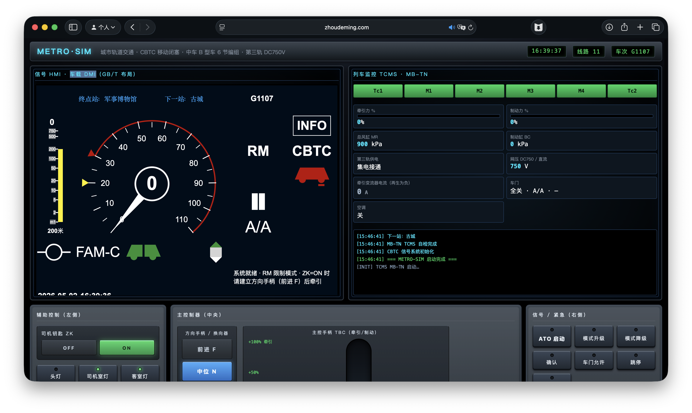
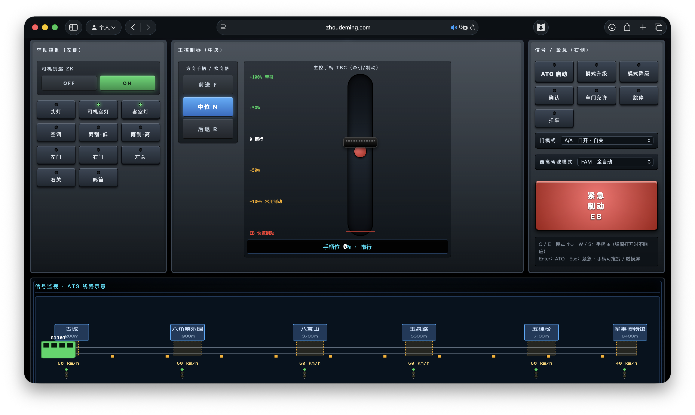
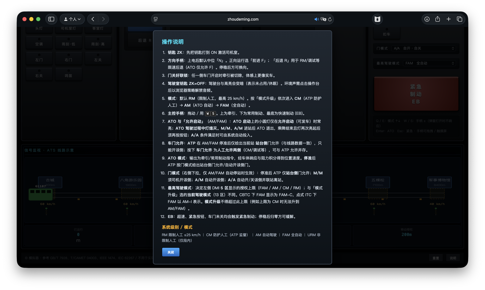

# 中国地铁列车驾驶模拟器

一个运行在浏览器里的城市轨道交通驾驶台模拟器。项目以中国地铁列车司机室为视觉和交互参考，组合了车载 DMI、TCMS、ATS 线路示意、主控手柄、车门、ATP/ATO、紧急制动与简化纵向动力学模型。

> 仅用于界面演示、教学讨论和交互体验，不可用于实际培训、考试、调试或运营决策。



## 快速开始

本项目是纯静态前端，没有构建步骤和运行时依赖。推荐用本地静态服务器打开，避免浏览器对 `file://` 下 ES Module 与 iframe 的限制。

```bash
python3 -m http.server 8000
```

然后访问：

```text
http://localhost:8000/
```

部署时请保留完整目录结构，尤其是 `vobc-dmi/` 和 `tcms-dmi/`，主界面会通过 iframe 加载这两个屏幕。

## 模拟内容

### 驾驶台

- 左屏为车载信号 DMI，采用 1024x768 的国标风格分区，并通过 `postMessage` 与仿真状态同步。
- 右屏为 TCMS 列车监控界面，显示 6 节编组、牵引/制动百分比、制动压力、网压、第三轨受流、车门和事件日志。
- 下方为 ATS 线路示意，展示站台、信号机、应答器、限速区段、列车位置和移动授权。



### 控制设备

- 左侧辅助区：司机钥匙 ZK、头灯、司机室灯、客室灯、空调、雨刮、左右车门和鸣笛。
- 中央主控区：方向手柄 F/N/R 与主控手柄 TBC，支持牵引、惰行、常用制动和快速制动。
- 右侧信号区：ATO 启动、模式升级/降级、确认、车门允许、跳停、扣车、门模式、最高驾驶模式和紧急制动按钮。

### 驾驶模式

- `RM`：限制人工驾驶，最高 25 km/h。
- `CM`：ATP 防护下的人工驾驶。
- `AM`：ATO 自动驾驶，按推荐速度曲线运行并自动对标停车。
- `FAM`：全自动运行模式，配合 A/A 门模式可自动完成开关门和续行。

## 基本操作

1. 确认司机钥匙 `ZK` 为 `ON`。
2. 将方向手柄置于 `前进 F`。
3. 默认进入 `RM`，可通过“模式升级”切换到 `CM`、`AM` 或 `FAM`。
4. 人工驾驶时拖动主控手柄，向上牵引，向下制动。
5. 在 `AM` 或 `FAM` 中，手柄回零、车门关闭、无 EB、无扣车且移动授权满足后，按“ATO 启动”。
6. 到站后根据门模式和 ATP 允许开门；乘降结束后关门，等待允许启动后继续运行。
7. 触发 EB 后列车会施加紧急制动；停稳并回零后可再次按 EB 按钮缓解。

## 快捷键

- `W` / `S`：主控手柄增加或减少 10%。
- `Q` / `E`：驾驶模式升级或降级。
- `Enter`：ATO 启动。
- `Esc`：紧急制动或缓解。
- `H`：鸣笛。



## 系统特性

- 车辆参考 6 节编组 B 型车，采用第三轨 DC750V 受流设定。
- 信号系统参考 CBTC 移动闭塞逻辑，包含 ATP 速度监督、EBI 限速和站内停车曲线。
- ATO 只输出牵引/制动加速度，列车位置与速度由物理引擎积分得到，不直接修正列车坐标。
- 线路包含 6 个车站、多个限速区段、应答器和信号机。
- 门控支持 `M/M`、`A/M`、`A/A`，并区分 ATP 站台侧门允许与人工两侧门允许。
- 简化物理模型包含牵引、常用制动、紧急制动、滚动阻力、空气阻力、制动建压滞后和电制动电流估算。

## 主要参数

- 最大牵引加速度：`1.0 m/s²`
- 最大常用制动：`1.1 m/s²`
- 紧急/快速制动：`1.3 m/s²`
- RM 限速：`25 km/h`
- ATP 超速 EB 裕量：限速 + `5 km/h`
- ATO 停车对标容差：约 `±5 cm`
- 仿真主循环：`30 Hz`

## 目录结构

```text
metro-simulator/
├── index.html                  # 主驾驶台页面
├── style.css                   # 主界面样式
├── vobc-dmi/
│   └── index.html              # 车载信号 DMI
├── tcms-dmi/
│   └── index.html              # TCMS 屏幕
├── js/
│   ├── main.js                 # 入口、主循环和 DOM 事件绑定
│   ├── config/                 # 仿真常量
│   ├── lib/                    # DOM 与数学工具
│   ├── systems/                # 车辆、ATP、ATO、车门、站务和物理模型
│   ├── audio/                  # 蜂鸣与环境声
│   └── ui/                     # 仪表渲染、DMI 桥接和线路视图
├── images/demo/                # README 截图
├── LICENSE
└── README.md
```

## 更新（v0.1.2）

新增功能（TCMS）：添加 TCMS 日志显示并更新样式

- 在 index.html 中新增日志显示部分，用于显示 TCMS 初始化消息。
- 优化日志显示和其他元素的 CSS 样式，以改善布局和视觉一致性。
- 更新 JavaScript 函数，以支持向 TCMS 日志发布消息并确保消息得到正确处理。

## 参考与声明

界面和逻辑参考公开资料中的城市轨道交通驾驶台、CBTC/ATP/ATO、TCMS 与地铁车辆常见设计，包括 GB/T 7928、T/CAMET 04003、IEEE 1474、IEC 62267 等相关标准或技术资料。项目实现经过简化和艺术化处理，不代表任何厂商真实设备、线路数据或运营规程。

## 许可证

本项目采用 MIT License，详见 `LICENSE`。
